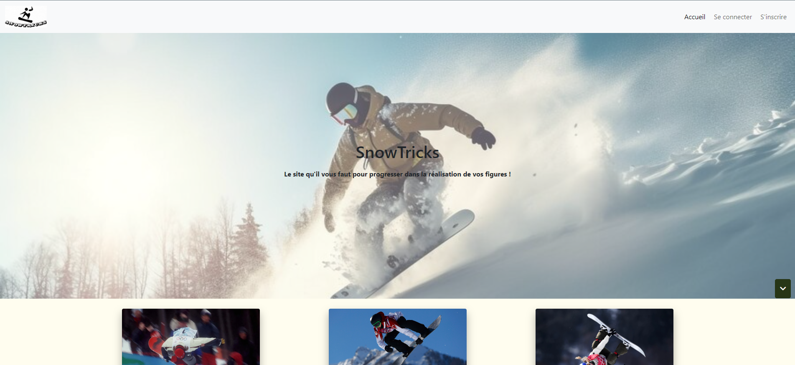
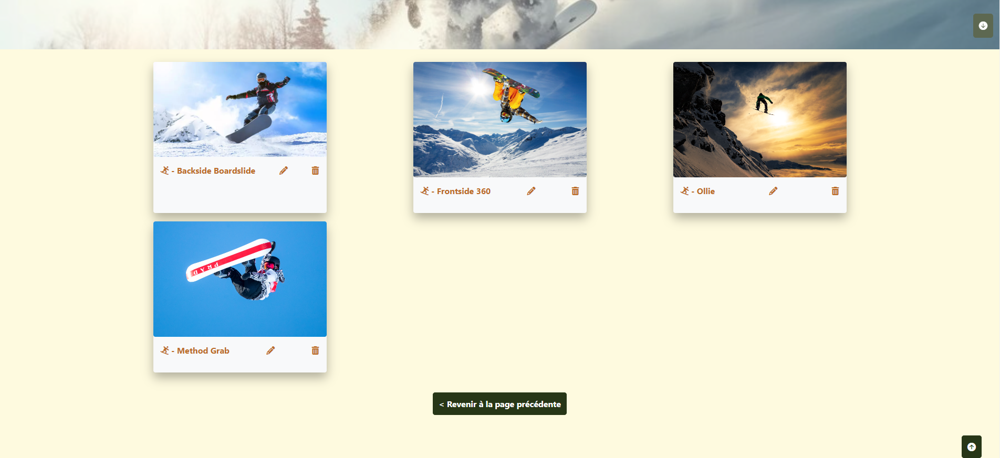
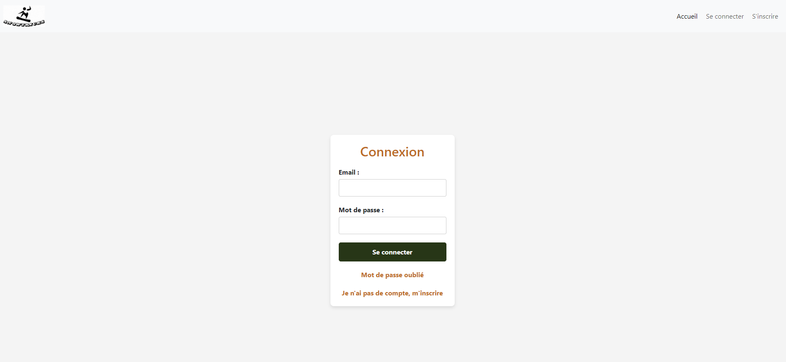
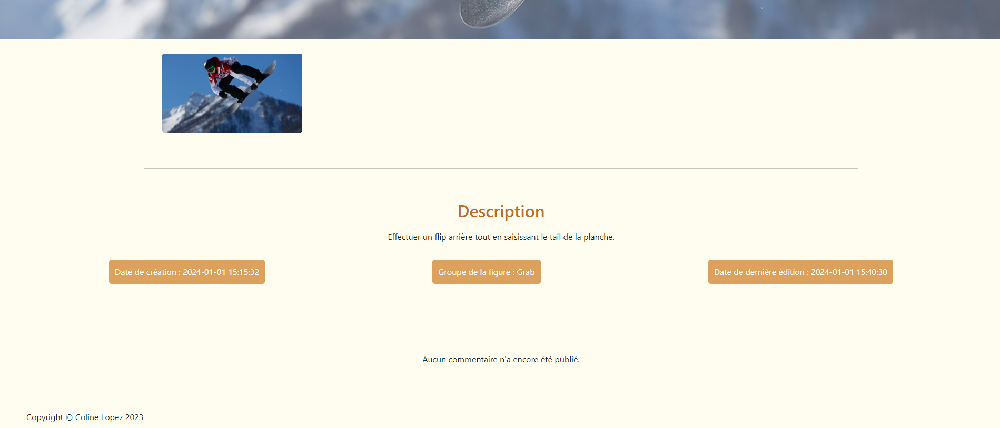

# ❄️ OpenClassrooms' Project #6 - SnowTricks

### 🌟 Project Overview 

The main objective of this project is to create a communautary blog about snowtricks using Symfony. The website is divided with two distinct categories of pages: those accessible to all visitors and those restricted to administrators.

### 🚀 Getting Started 

1. Clone the repository

`git clone https://github.com/ColineLopez/OpenClassrooms_Project_6_SnowTricks.git`

`cd Projet-6`

2. Install Dependencies

`composer install`

3. Set up your environment variables configuring it according to your environment.

4. Run Migrations

`php bin/console doctrine:database:create`

`php bin/console doctrine:migrations:migrate`

5. Start the Symfony Server

`symfony server:start`

### 🧩 Features

#### 🛠️ Create, Update, and Delete Figures:
Users can create, modify, and delete snowboard figures through a user-friendly interface.

#### 💬 Add Comments:
Users can add comments to share their thoughts, tips, or experiences related to a specific snowboard figure. This feature enhances community engagement and interaction.

### 🛠️ Workspace environment 

This project was developed only on a local server.

### 📸 App Overview

