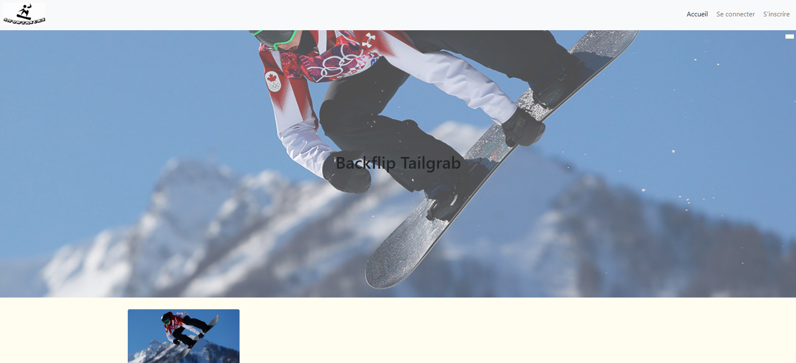

# SnowTricks - OpenClassrooms' Projet 6

### Context 

The main objective of this project is to create a communautary blog about snowtricks using Symfony. The website is divided into two distinct categories of pages: those accessible to all visitors and those restricted to administrators.

### Workspace environment 

This project was developed only on a local server.

    PHP version : 8.0.26
    MySQL version : 8.0.31
    Composer required

### Install Project on your machine 

    git clone https://github.com/ColineLopez/Projet-6.git
    cd Projet-6
    composer install

### Project's screenshot

